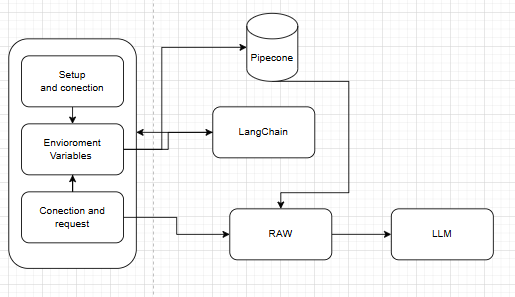
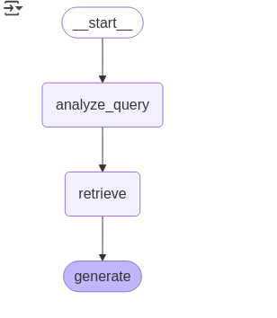
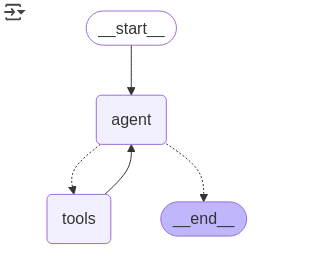
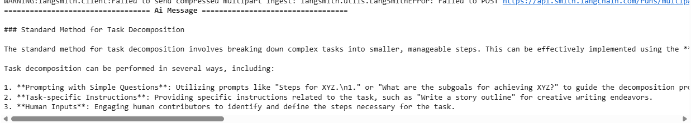

# Retrieval-Augmented-Generation-RAW-

This project demonstrates the use of a vector database to enhance the prompt. Using RAW (Retrieval-Augmented Generation), a technique that provides sufficient context within the prompt, the LLM can be more tailored to meet the needs of a business or application. The data can be fed from various sources, including documents and URLs.

## What is the project about?

This project connects to Pinecone, LangChain, and consumes an OpenAI agent, which serves as the model that will receive the contextual information.

## What needs to be installed?

- Jupyter or, alternatively, Colab.
- **Colab is recommended** as it allows you to install dependencies and execute commands without the need to download packages locally. This simplifies the setup process and avoids potential issues with local installations.

## How do you run the project locally?

To run the project locally:
- Open the document in Jupyter or Colab.
- Execute each function in order to interact with the model.
- The functions will guide you through setting up the environment, connecting to the model, and running tests.

## What architecture does it have?

## What is the project structure?

The project is organized into the following sections:
- **Set Up:** Initial setup steps, including the installation of necessary libraries.
- The connection to Pinecone is established to inject the vector database.
- The connection to LangChain is made for enabling tracking.
- **Set Environment Variables:** Defining required environment variables like API keys.
- The context is set to improve the prompt, providing richer information for better results:
  
- A secondary step improves the agent and fine-tunes the prompt:
  
- **Use Model:** Connecting to the LLM and executing the necessary functions for testing.

## Results of how it looks.

Here’s an example of the expected output and how the results from the model appear after running the tests.

## Author

Yeferson Mesa

## Sources

- [Langchain RAG Tutorial](https://python.langchain.com/docs/tutorials/rag/)
- [Langchain QA Chat History Tutorial](https://python.langchain.com/docs/tutorials/qa_chat_history/)
